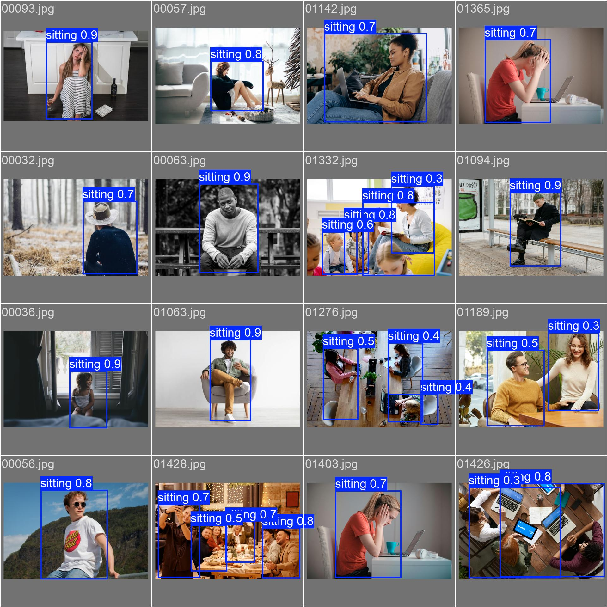

# PresenceEye AI Model: Weekly Progress Report

## Week 1 (v0.1)

### Introduction
The PresenceEye AI model is an intelligent system designed to optimize energy usage by detecting human activities and gestures such as sitting, standing, walking, and basic gestures. This week focused on detecting the "sitting" class, with plans to expand to other activities and gestures in future iterations.

---

### Summary of Achievements
- **Dataset**:
    - Total Images: **238**
    - Annotation Classes: **Sitting** (Class 0)
- **Training Configuration**:
    - Epochs: **50**
    - Image Size: 640x640
    - Batch Size: 16
    - Learning Rate: 0.01
- **Performance Metrics**:
    - Training Loss: **3.4530**
    - Validation mAP: **0.7595**
    - Inference Speed: 260ms/image

---

### Training Visualizations
1. **Confusion Matrix**:
    - 
    - Description: Illustrates the model's predictions versus actual labels, showing class accuracy.
2. **Performance Curves**:
    - **Precision-Recall (PR) Curve**:
      
        - Description: Indicates how precision and recall vary with confidence thresholds.
    - **F1 Curve**:
      
        - Description: Highlights the harmonic mean of precision and recall across thresholds.
    - **P (Precision) Curve**:
      
    - **R (Recall) Curve**:
      
3. **Labels Analysis**:
    - 
    - Description: Analyzes the distribution of labels across the dataset.
4. **Batch Samples**:
    - 
    - 
    - Description: Examples of training data and predictions during validation.

---

### Challenges
1. **Misclassification**: The model often confused "standing" and "walking" images with "sitting" due to the single-class dataset.
2. **Dataset Limitation**: The training data only included the "sitting" class, which limited the model's generalization.

---

### Lessons Learned
- **Visual Feedback is Crucial**: Analyzing confusion matrices and performance curves helped identify areas of improvement.
- **Dataset Diversity Matters**: Expanding the dataset to include standing, walking, and basic gestures is essential for reducing misclassification.

---

### Next Steps for Week 2
1. **Dataset Expansion**:
    - Incorporate images annotated with "standing," "walking," and basic gestures.
    - Increase the dataset size for better generalization.
2. **Model Fine-Tuning**:
    - Retrain the model with multiple classes and monitor the PR and F1 curves.
3. **Performance Evaluation**:
    - Focus on reducing false positives/negatives as indicated by the confusion matrix.

---

### Final Remarks
The training directory files provide a comprehensive understanding of the model's performance during Week 1. Visualizations such as confusion matrices and PR curves help pinpoint areas of improvement, laying the groundwork for iterative progress. Week 2 will focus on diversifying the dataset and addressing current limitations.

